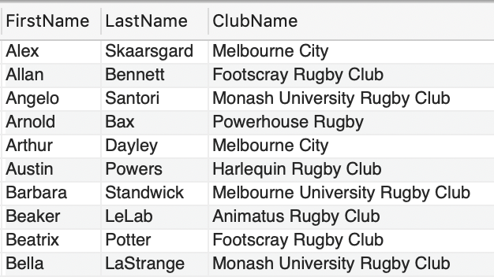
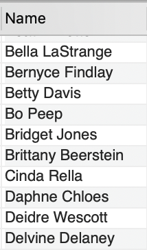
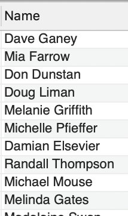
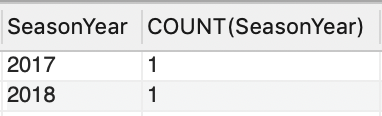
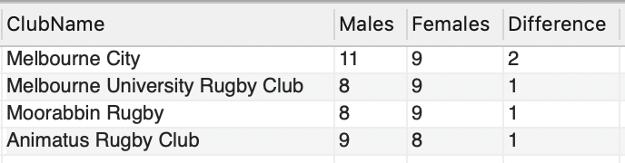
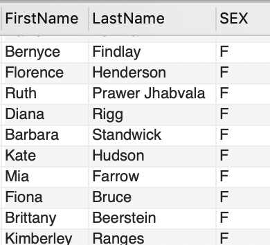
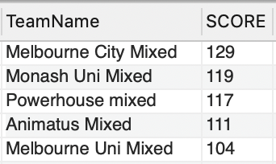
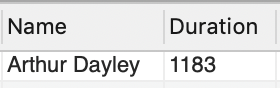
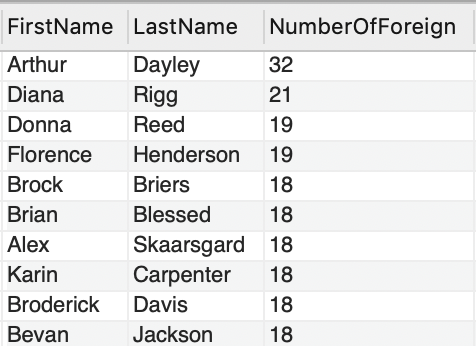
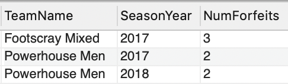

# DB-2020-2

## src/ 
All of the stuff to build the database

## Answers

### Q1: List the first name and last name of all players who have ever played in the league and their current club if applicable. List the players in ascending alphabetical order, primarily on last name and secondarily on first name. A game is still considered to have been 'played' even if it was cancelled or a walkover. (1 mark)

```sql 
SELECT FirstName, LastName, ClubName
FROM player
LEFT JOIN playerteam -- Different for inner vs left
ON player.playerID = playerteam.playerID
INNER JOIN clubplayer
ON player.playerID = clubplayer.playerID
RIGHT JOIN club
ON clubplayer.ClubID = club.ClubID
WHERE clubplayer.FromDate < CURDATE() && (clubplayer.ToDate IS NULL || clubplayer.ToDate > CURDATE())
GROUP BY FirstName, LastName, ClubName
ORDER BY FirstName, LastName ASC 
```


143 rows returned
 
### Q2: List the full name (presented as a single string) of female players who have played for more than one team. (1 mark) 

```sql 
SELECT  CONCAT(FIRSTNAME," ", LASTNAME) As Name
FROM player
INNER JOIN playerteam -- Different for inner vs left
ON player.playerID = playerteam.playerID
INNER JOIN clubplayer
ON player.playerID = clubplayer.playerID
RIGHT JOIN club
ON clubplayer.ClubID = club.ClubID
WHERE Sex = 'F'
GROUP BY FirstName, LastName, ClubName
HAVING count(ClubName)>1
ORDER BY FirstName, LastName ASC
```


73 rows returned
 

### Q3: List the full name (presented as a single string) of players who have never played in a 'mixed’ competition. (1 mark)

```sql 
SELECT CONCAT(FirstName, " ", LastName) As Name
FROM
player
WHERE playerID NOT IN (
SELECT player.PlayerID
FROM player
NATURAL JOIN playerteam -- Different for inner vs left
NATURAL JOIN game
NATURAL JOIN season
NATURAL JOIN competition
WHERE CompetitionType LIKE "%Mixed%"
GROUP BY PlayerID, CompetitionType
)
```


15 rows returned
 
### Q4: List the season year(s) with the highest number of cancelled games, and the corresponding number of cancelled games in the year(s). (2 marks)

```sql 
SELECT SeasonYear, COUNT(SeasonYear)
FROM game
NATURAL JOIN season
WHERE T1Score is NULL AND T2Score is NULL
GROUP BY SeasonYear
```


2 rows returned

 
### Q5: List the name of the clubs where the number of current male members is not the same as the number of current female members. For these clubs, present the number of current male and female players, and the absolute difference between the number of current males and females in the club. Order the results by the absolute difference between current males and females in the club, with the club having the highest difference listed first. (2 marks)

```sql 
SELECT ClubName, SUM(Sex LIKE 'M') as Males, SUM(Sex LIKE 'F')as Females , ABS(SUM(Sex LIKE 'M') - SUM(Sex LIKE 'F')) as Difference
FROM club
NATURAL JOIN clubplayer
NATURAL JOIN player
WHERE clubplayer.FromDate < CURDATE() && (clubplayer.ToDate IS NULL || clubplayer.ToDate > CURDATE())
GROUP BY ClubName
HAVING Males != Females
ORDER BY Difference DESC
```


4 rows returned

 
### Q6: List the first name, sex, and number of games played in 2018 and 2017 of players who played more games in 2017 than in 2018. There might be players that didn’t play in 2018 but did in 2017. You should take these cases in account as well. A game is still considered to have been 'played' even if it was cancelled or a walkover. (2 marks) 

```sql 
SELECT FirstName, LastName, SEX
FROM player
NATURAL JOIN playerteam
NATURAL JOIN game
NATURAL JOIN season
GROUP BY FirstName, LastName, SEX
HAVING SUM(SeasonYear LIKE 2018) < SUM(SeasonYear LIKE 2017) 
```


50 rows returned
 
### Q7: List the name of all teams that scored more than 100 points in the Bingham Trophy in 2017, along with the total points they scored. Order the result according to the points the team scored, highest scoring team first. (2 marks)
```sql
SELECT TeamName,
SUM(CASE
	WHEN Team1 = TeamID THEN T1Score
	WHEN Team2 = TeamID THEN T2Score
END) AS SCORE

FROM competition
NATURAL JOIN season
NATURAL JOIN game
INNER JOIN team
ON game.Team1 = team.TeamID OR game.Team2 = team.TeamID
WHERE CompetitionName LIKE "Bingham Trophy"
AND SeasonYear = 2017
GROUP BY TeamName
HAVING SCORE > 100
ORDER BY SCORE DESC
```


5 rows returned
 
### Q8: For the player who has spent the fewest number of days as a member of ‘Melbourne City’ club as of April 30th 2020, give the full name (presented as a single string) and the total number of days spent as a member. Only consider players who have been a member of the club at some point (i.e. do not include players who have never been signed up with Melbourne City). Assume there are no joint shortest serving players. (3 marks)

```sql 
SELECT CONCAT(FirstName, " ",  LastName) as Name, DATEDIFF('2020/04/30', FromDate) as Duration
FROM club
NATURAL JOIN clubplayer
NATURAL JOIN player
WHERE clubName LIKE "Melbourne City"
AND ToDate is NULL
GROUP BY FirstName, LastName, FromDate
ORDER BY Duration ASC
LIMIT 1
```


1 rows returned


 
### Q9: A ‘foreign game’ is when a player has played a game in a team which was not part of the club they were a member of at the time. Find the first and last names and the number of ‘foreign games’ played for the 20 players who have played the most ‘foreign games’. List them from highest number of foreign games to lowest. (3 marks)

```sql 
SELECT FirstName, LastName, COUNT(*) AS NumberOfForeign
FROM player
NATURAL JOIN playerteam
NATURAL JOIN clubplayer
JOIN team
ON playerteam.TeamID = team.TeamID
JOIN club
ON club.ClubID = clubplayer.ClubID
WHERE team.ClubID != club.ClubID
GROUP BY FirstName, LastName
ORDER BY NumberOfForeign DESC
LIMIT 20
``` 


20 rows returned

 
### Q10: Return the team name, the highest number of walkovers (forfeits) the team has ever given away in a season, and the season year(s) during which this occurred for teams who have given away 2 or more walkovers in the same season. Assume that any game with one team scoring 28 and the other scoring 0 implies that the game was a walkover. (3 marks)

```sql 
SELECT TeamName, SeasonYear, COUNT(*) AS NumForfeits
FROM team
INNER JOIN game
ON game.Team1 = team.TeamID OR game.Team2 = team.TeamID
NATURAL JOIN season
WHERE (T1Score = 0 AND T2Score = 28) OR (T1Score = 28 AND T2Score = 0)
GROUP BY TeamName, SeasonYear
HAVING NumForfeits >= 2
ORDER BY NumForfeits DESC
```


3 rows returned
